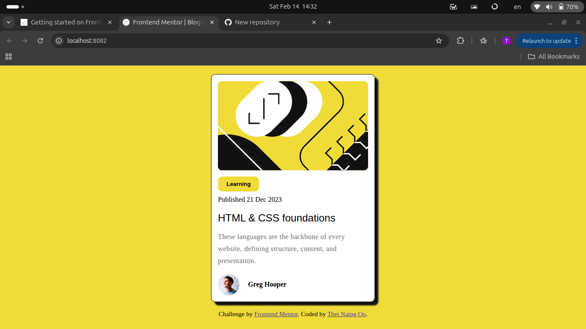

# Frontend Mentor - Blog preview card solution

This is a solution to the [Blog preview card challenge on Frontend Mentor](https://www.frontendmentor.io/challenges/blog-preview-card-ckPaj01IcS). Frontend Mentor challenges help you improve your coding skills by building realistic projects. 

## Table of contents

- [Overview](#overview)
  - [The challenge](#the-challenge)
  - [Screenshot](#screenshot)
  - [Links](#links)
- [My process](#my-process)
  - [Built with](#built-with)
  - [What I learned](#what-i-learned)
  - [Continued development](#continued-development)
  - [Useful resources](#useful-resources)

## Overview

### The challenge

Users should be able to:

- See hover and focus states for all interactive elements on the page

### Screenshot

### Links

- Solution URL: [Add solution URL here](https://github.com/Thet81/blogPreviewCard)

## My process

### Built with

- Semantic HTML5 markup
- Flexbox

### What I learned

I have learned `CSS` features such as `box-shadow`, `flex-box` and `CSS psuedo-class `(`hover`) while doing this challenge.

### Continued development

In the future projectes, I will use `CSS grid` and `flex-box` accrodingly.

### Useful resources

- [CSS psuedo-class hover](https://developer.mozilla.org/en-US/docs/Web/CSS/Reference/Selectors/:hover) - This helped me how to use `hover` class in my project.

## Author

- Frontend Mentor - [@Thet81](https://www.frontendmentor.io/profile/Thet81)

## Acknowledgments
